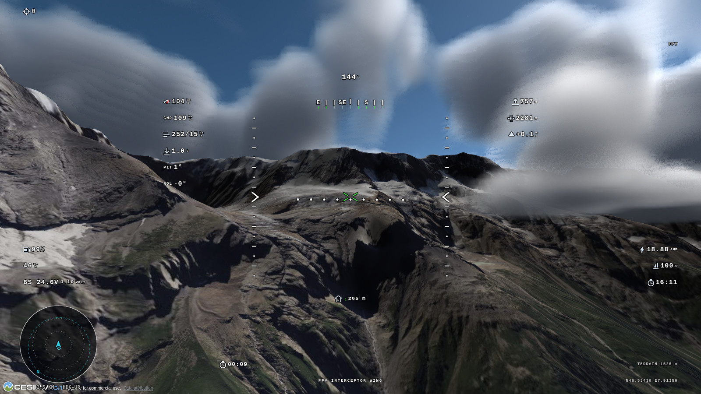
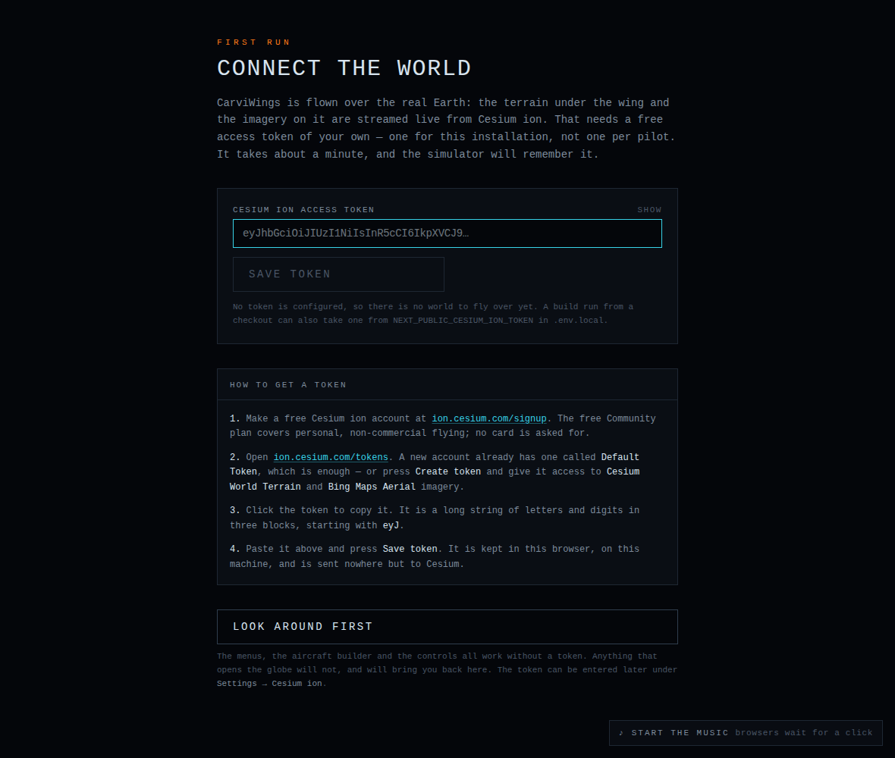
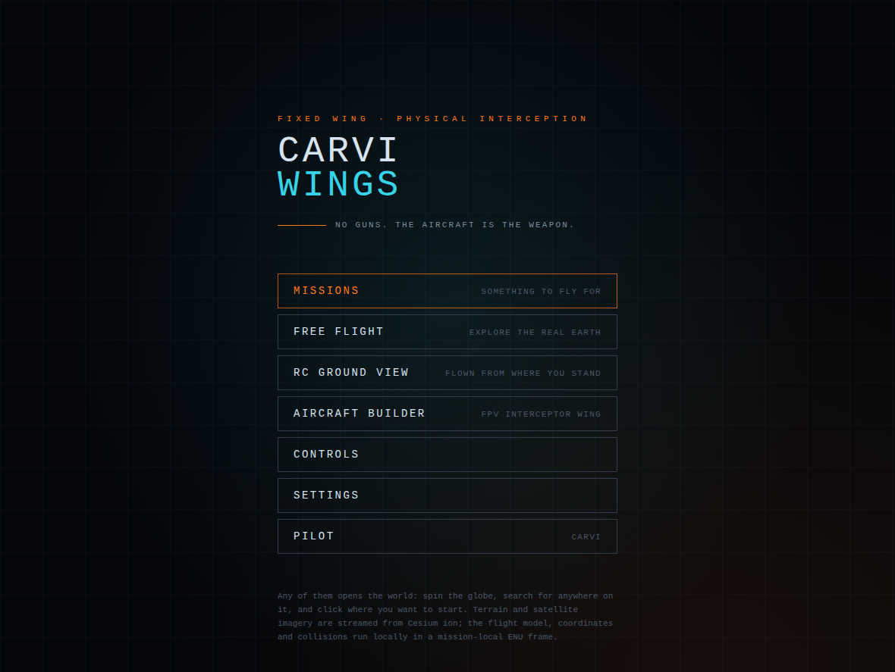

# CarviWings



A browser FPV simulator flown over the real Earth. Terrain, satellite imagery
and 3D buildings stream from Cesium ion, so any point on the planet can be
flown from.

Thirteen aircraft: three fixed wings, a foam-board triplane, a twin-boom foam
warbird, a foam-board biplane, two multirotors and five petrol-engined
aeroplanes. Seven ways to fly them: two open flights and five missions.

There are no guns, missiles or projectiles. In the combat missions the aircraft
itself is the weapon — you fly it into the target, and the charge the airframe
carries does the rest. Anything short of that is a mid-air: a damage model, not
a switch, so an aircraft can come out of one still flying, and flying badly.

Everything runs in the browser. There is no server, no account and no database;
the only thing the simulator needs from outside is a free Cesium ion token.

---

## Quick start

### 1. Install it

Download `CarviWings_<version>_x64-setup.exe` from the
[Releases page](https://github.com/CarviFPV/CarviWings/releases)
and install it, or take the `-portable.exe` beside it and run it as one file —
that one installs nothing and can be carried on a stick.

Neither executable is code-signed, so Windows will report an unknown publisher:
**More info → Run anyway**.

Windows x64 is the only build published. macOS, Linux and the browser fly the
same simulator from the source instead — see
[Running from a checkout](#running-from-a-checkout) below, which is also the way
in for anyone who wants to work on it.

### 2. Get a Cesium ion token

The first screen asks for a **Cesium ion access token**. It is free and takes
about a minute. Without one there is no world to fly over.



1. Go to <https://ion.cesium.com/signup> and make a free account. The
   **Community** plan covers personal, non-commercial use and asks for no card.
2. Open <https://ion.cesium.com/tokens>. A new account already has a **Default
   Token**, which is enough to fly on. To make your own instead, press **Create
   token** and give it access to **Cesium World Terrain** and **Bing Maps
   Aerial** imagery.
3. Click the token to copy it. It is a long string in three blocks separated by
   full stops, starting with `eyJ`.
4. Paste it into the field on the first-run screen and press **Save token**.

The token is remembered in the browser's local storage; nothing has to be
edited or restarted. If the paste brings a `NEXT_PUBLIC_CESIUM_ION_TOKEN=`
prefix, quotes or a line break with it, they are stripped off.

One token serves the whole installation — every pilot flying in this browser
uses it. It is sent only to Cesium, is never written into a pilot backup, and
is not touched by "Restore defaults".

**Changing it later:** Settings → **Cesium ion**. The panel shows whether a
token is saved, replaces it, or forgets it. A new token applies to the next
flight with nothing to reload.

### 3. Pick a callsign

The second screen asks for a callsign. Settings, key layout, controller
calibration and every logged flight belong to that pilot. Add more from
**Pilot** on the main menu.

### 4. Fly

**Free Flight** on the main menu is the shortest route into the air: click
anywhere on the globe, set a height and a heading, and go.



---

## Running from a checkout

The release above is a Windows build of exactly what is in this repository.
Running the source is the way in everywhere else — macOS, Linux, or any browser
on the machine — and the way to work on it. [Node.js](https://nodejs.org) 20.9
or newer, npm and git are all it needs.

```bash
git clone https://github.com/CarviFPV/CarviWings.git
cd CarviWings
npm install
npm run dev                    # http://localhost:3000
```

`npm install` fetches the dependencies. `npm run dev` starts the development
server and serves the simulator at <http://localhost:3000>; the first start also
stages CesiumJS into `public/cesium`, so it takes a few seconds longer than the
ones after it. `Ctrl-C` stops the server, and `npm run dev` again picks up
wherever the pilot got to — everything is in the browser.

Open the address and the application asks for the same **Cesium ion token** as
[step 2 of the Quick start](#2-get-a-cesium-ion-token) above, then for a
callsign. Nothing else has to be set up.

**A branch rather than `main`.** Clone the branch straight away:

```bash
git clone -b <branch> https://github.com/CarviFPV/CarviWings.git
cd CarviWings
npm install
npm run dev
```

or switch an existing checkout over to one:

```bash
git fetch origin
git switch <branch>            # git checkout <branch> on older git
npm install                    # in case the branch moved a dependency
npm run dev
```

`npm install` is worth repeating after any switch or pull: it is a no-op when
nothing has changed, and the dev server has to be restarted to pick up a
dependency that has.

**A production build** is `npm run build`, then `npm run start` to serve it. The
desktop window around the same build is `npm run desktop:dev` and the installer
is `npm run desktop:build`; both need a Rust toolchain, and
[The desktop application](docs.md#the-desktop-application) has the detail.

### The token in the environment instead

A checkout can be handed the Cesium ion token in its environment rather than
through the first-run screen. It is the same token, from the same place: see
[Get a Cesium ion token](#2-get-a-cesium-ion-token) above for how to make one.

```bash
cp .env.example .env.local     # then paste your token into it
```

```env
NEXT_PUBLIC_CESIUM_ION_TOKEN=your_token_here
```

`NEXT_PUBLIC_` values are inlined at build time, so the dev server has to be
restarted to pick one up, and a build carries whatever was in `.env.local` when
it was made. A token entered in the application overrides it for that browser,
and Settings → **Cesium ion** is still where it is changed afterwards.
`.env.local` is git-ignored; never commit a real token.

`.env.example` also carries `NEXT_PUBLIC_GOOGLE_MAPS_API_KEY`, which is optional
and not needed to fly — it is only for billing the photorealistic tiles to
Google rather than to Cesium ion, and is covered under
[World detail](docs.md#world-detail).

### The scripts a checkout needs

| Command | What it does |
| --- | --- |
| `npm run dev` | Development server on <http://localhost:3000> |
| `npm run build` | Production build |
| `npm run start` | Serve the production build |
| `npm run typecheck` | `tsc --noEmit` |
| `npm run test:sim` | The simulation test suite |
| `npm run desktop:dev` | The desktop window, on a live dev server (needs Rust) |
| `npm run desktop:build` | The packaged desktop application (needs Rust) |

`predev` and `prebuild` stage CesiumJS into `public/cesium`, which is generated
and git-ignored — that is why the first `npm run dev` takes a few seconds
longer than the ones after it.

Run `npm run typecheck` and `npm run test:sim` before considering a change to
`src/sim/**` finished. [Development](docs.md#development) has the source layout,
the rest of the scripts and what the test suite covers.

---

## Everything else

The full manual is **[docs.md](docs.md)**:

| | |
| --- | --- |
| [Controls](docs.md#controls) | The key table, rebinding, game pads and transmitters |
| [Choosing where to fly](docs.md#choosing-where-to-fly) | The globe, search, coordinates, and how much world is drawn |
| [Modes](docs.md#modes) | Free flight, ground view, intercept, strike, race, formation, festival |
| [The hangar](docs.md#the-hangar) | The thirteen aircraft and how each of them flies |
| [The aircraft builder](docs.md#the-aircraft-builder) | Motors, packs, engines, tanks, rates and paint |
| [Flight modes](docs.md#flight-modes) | Acro, angle, the holds, and the return home |
| [The weather system](docs.md#the-weather-system) | Live and typed METAR, cloud, wind aloft, rain and snow |
| [The video link](docs.md#the-video-link) | Transmitter power, range, terrain shadow and static |
| [The HUD](docs.md#the-hud) | The OSD, the minimap and the layout editor |
| [Sound and music](docs.md#sound-and-music) | A synthesised soundscape and SomaFM |
| [Pilots and backups](docs.md#pilots-logbook-and-backups) | The roster, the logbook and the JSON backup |
| [Settings reference](docs.md#settings-reference) | Every setting, category by category |
| [The desktop application](docs.md#the-desktop-application) | The Tauri shell, and how a release is cut |
| [Development](docs.md#development) | Layout, testing and the stack |

---

CarviWings is sponsored by **[CarviLabs](https://carvilabs.com)**.

---

Next.js 16 (App Router) · React 19 · TypeScript (strict) · Tailwind CSS 4 ·
CesiumJS · Zustand · Rapier
