# CarviWings — the manual

Everything the simulator does, in one document. The
[README](README.md) is the short way in: download or clone it, get a Cesium ion
token, and fly. This is the rest — the controls, the modes, the aircraft, the
weather, the video link, the HUD, the settings and the desktop build.

## Contents

- [Controls](#controls) — the key table, rebinding, controllers
- [Choosing where to fly](#choosing-where-to-fly) — the globe, search, world detail
- [Modes](#modes) — free flight, ground view, intercept, strike, race, formation, festival
- [The hangar](#the-hangar) — the ten aircraft, and how they fly
- [The aircraft builder](#the-aircraft-builder) — power systems, rates, livery, saved builds
- [Flight modes](#flight-modes) — the flight controller and what it will not do
- [The weather system](#the-weather-system) — time, cloud, wind, rain and snow
- [The video link](#the-video-link) — transmitter power, range, terrain and static
- [The HUD](#the-hud) — the OSD, the minimap, and arranging them
- [Sound and music](#sound-and-music) — the synthesised soundscape and the radio
- [Pilots, logbook and backups](#pilots-logbook-and-backups)
- [Settings reference](#settings-reference)
- [The desktop application](#the-desktop-application) — Tauri, and how a release is cut
- [Development](#development) — scripts, layout, testing, stack

## Controls

| Key | Action |
| --- | --- |
| `↑` / `↓` | Pitch up / down |
| `←` / `→` | Roll left / right |
| `W` / `S` | Throttle up / down |
| `A` / `D` | Yaw left / right |
| `F` | Flight mode: manual / acro / angle |
| `C` | Course hold |
| `H` | Altitude hold |
| `R` | Return home |
| `V` | Camera: FPV / chase, and the field on a ground-view flight |
| `M` | Toggle minimap |
| `T` | Cycle target (steps through contacts by range) |
| `Esc` | Pause |
| `F3` | Debug overlay |
| `F1` | Reset aircraft (development) |
| `F2` | Spawn an enemy interceptor (development) |
| `F4` | Free camera (development) |

Every binding is editable under **Controls**: click the key beside an action to
press a new one, `Backspace` to unbind it, `Esc` to cancel. Pause can be moved
but not unbound. A key can mean only one thing, so reassigning one takes it
from whatever had it. Bindings are physical keys (`KeyboardEvent.code`), stored
per browser, and apply immediately including mid-flight. **Reset all** restores
the table above.

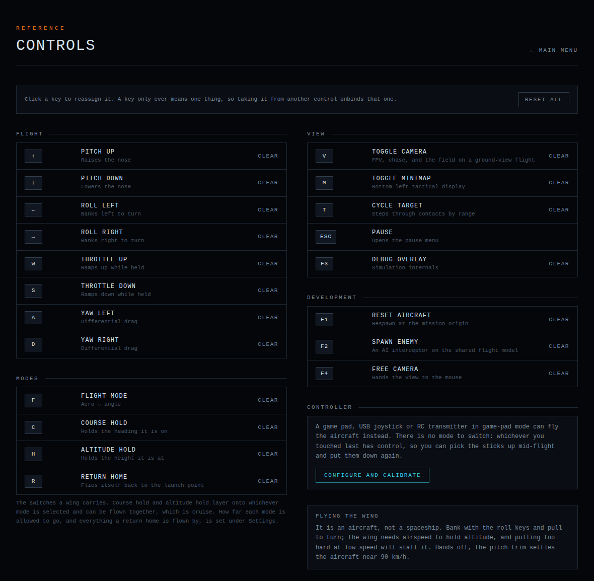

On the world map the mouse drives the camera instead: drag to rotate, scroll to
zoom, middle-drag to tilt, click to set the start point.

### Controllers

Game pads, USB joysticks and RC transmitters in game-pad mode are supported.
There is no mode to switch: whichever input moved last has control, so sticks
can be picked up mid-flight and put down again.

**Controls → Configure and calibrate** covers axis mapping, inversion, dead
zones, expo, sensitivity and button bindings, and includes a calibration that
learns the layout by asking for each stick in turn. Profiles are stored per
pilot.

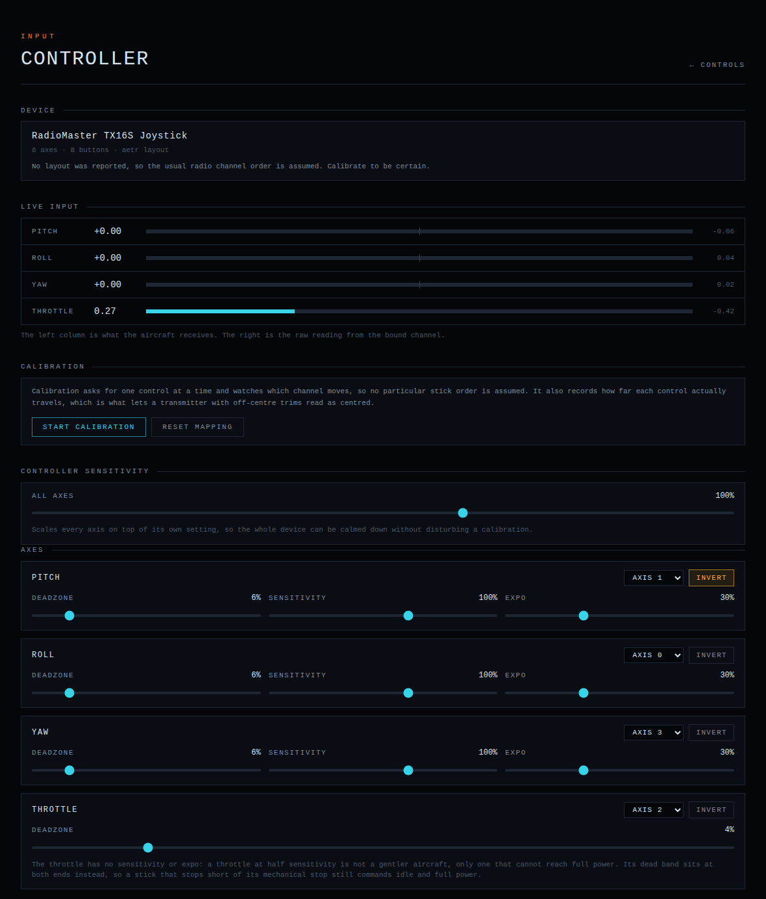

Flying is aerodynamic, not arcade: bank and pull to turn, keep airspeed up or
the wing stalls. Hands off, pitch trim settles the interceptor near 90 km/h.

---

## Choosing where to fly

Every flight starts on the globe — the same real Earth the flight itself
streams, spun with the mouse.

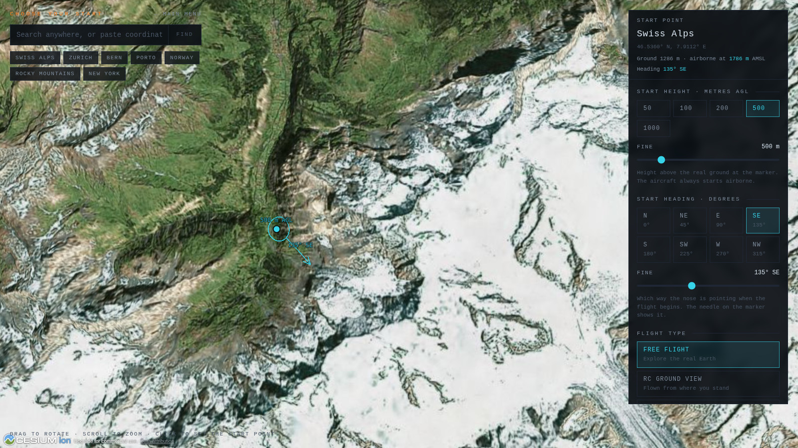

- **Drag** to rotate, **scroll** to zoom, **middle-drag** to tilt.
- **Click the ground** anywhere on the planet to set the start point. A ring
  marks the spot, a stem shows the height above it, and the top of the stem is
  where the aircraft appears.
- **Search** finds places by name through Cesium ion's geocoder.
- The search box also takes **coordinates** in decimal or sexagesimal form:
  `46.5375, 7.9625`, `46.5375N 7.9625E`, `46° 32' 15" N, 7° 57' 45" E`, in
  either order when hemisphere letters say which is which. These are parsed
  locally.
- **Start height**: 50 m to 3 km above the ground under the marker, opening on
  50 m. The RC ground view asks for none — the aircraft is at your feet.
- **Start heading**: the eight compass points or any degree. It turns the whole
  start — the aircraft, the launcher's patch of field, the formation leader's
  station, and the race grid with its run-in.
- **Flight type** is chosen here too.
- Seven preset locations are available as bookmarks that fly the camera.

A picked point takes the name of whatever was searched for within 25 km of it,
and is reported as plain coordinates otherwise.

Ground elevation under the marker comes from the terrain data rather than the
drawn mesh; the panel says "estimated" for the moment before the real sample
lands.

### World detail

Settings → **World detail** picks what stands on the terrain:

| Setting | What you get |
| --- | --- |
| Terrain only | Terrain and imagery, nothing standing on it |
| **Buildings** (default) | Every OpenStreetMap building footprint on the planet, extruded to its mapped height |
| Photorealistic | Google's photogrammetry mesh: buildings, trees, forests, bridges and masts as geometry, worldwide |

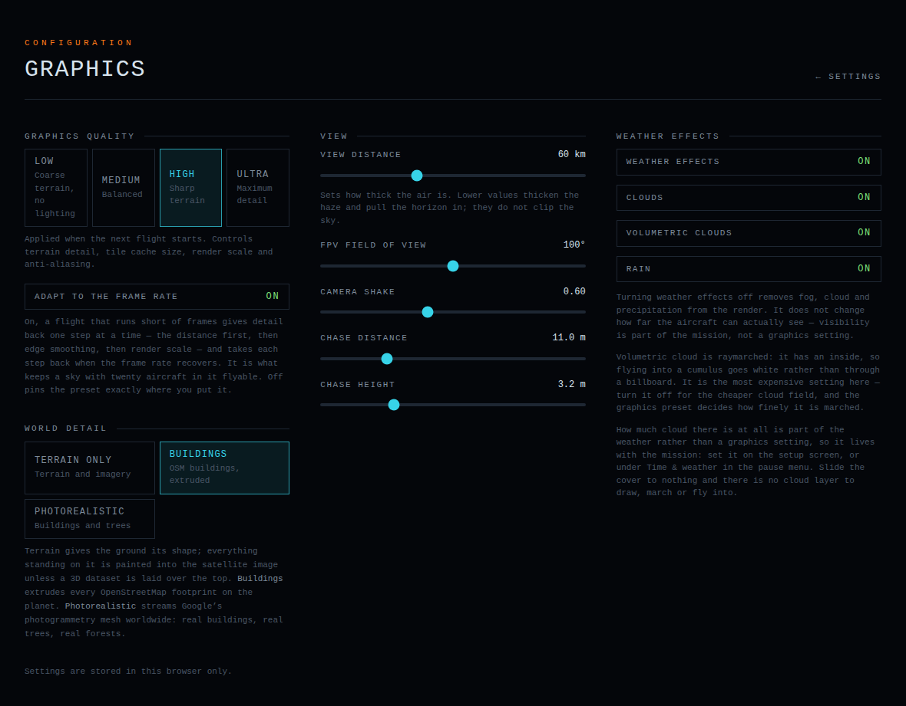

Both extra datasets are served on the ion token already configured and are
included on ion's free Community plan. Photogrammetry is metered by *root
tile*, roughly one per flight; add the asset to your ion account once from the
Asset Depot.

With photorealistic tiles:

- The plain globe is switched off underneath the mesh, so areas Google does not
  cover read as empty rather than as satellite imagery.
- Collisions follow the terrain height field, which is bare earth — you can fly
  through a building or a tree that you can see.
- Take-off waits until the mesh around the spawn has finished arriving. If the
  tile session cannot be opened the flight stops and offers a retry or the
  buildings; it never silently substitutes them.

If OSM buildings cannot be loaded, the scenery falls back to bare terrain and
the reason is shown in the debug overlay (`F3` → **World detail**).

A Google Maps Platform key can be used instead of ion for the photogrammetry.
It is optional and off by default: create a key with the **Map Tiles API**
enabled, restrict it to your domains, and put it in `.env.local` as
`NEXT_PUBLIC_GOOGLE_MAPS_API_KEY`. Neither credential ever appears in an error
message.

Cost on ion's free plan is nothing beyond the token: terrain, imagery, the
geocoder, global buildings and the photogrammetry are all covered for personal,
non-commercial use with attribution kept on screen, which the map does.

---

## Modes

The main menu offers two open flights, then **Missions**, then the aircraft
builder, Controls, Settings and Pilot.

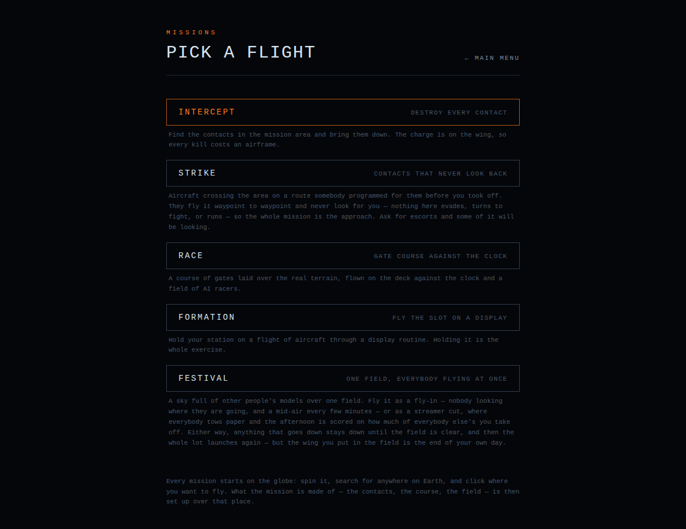

### Free Flight

No objectives and nobody else in the sky. You start airborne over anywhere on
Earth with one airframe.

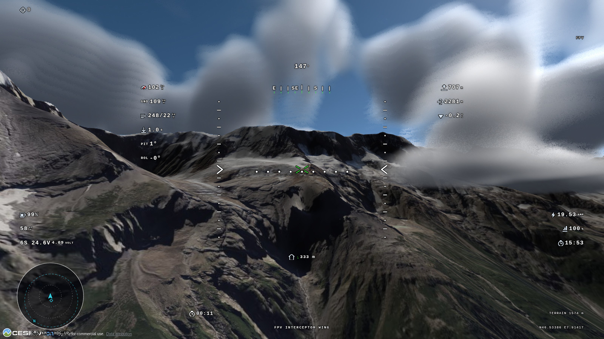

### RC Ground View

The same flying done the way a model is actually flown. You stand on the field,
the aircraft starts at your feet, and you can only see it from where you are
standing.

How it leaves the ground follows the airframe:

- **A wing is thrown** — out of the launcher's hand at head height, twenty
  degrees nose up, full throttle. Throw speed comes off the airframe: 11 m/s,
  or a fifth over the stall for anything that needs more.
- **A multirotor is put down** — it sits on its arms with the throttle closed
  and lifts when you open it. There is no arming switch.
- **An aeroplane is started on a runway** — a Skyeye stands on its own
  undercarriage with the engine idling and the stick shut, then it is throttle,
  roll, rotate at about a fifth over the stall, and fly.

The camera stands at head height a few metres behind the launch point and never
moves; only the head turns, tracking the aircraft. The view narrows as the
aircraft goes out and opens back up as it returns, never past what somebody
standing there could take in at once. The camera key still cycles FPV, chase
and the field.

Head height is measured off the ground the launch is actually standing on
rather than off the single elevation reading under it. Two things move it. The
ground within a couple of paces, because a height field is a grid and between
its corners it cuts the corner off every rise — on a flat field that changes
nothing, in a hollow or on a bank it is a step up out of the dip. And the
surface the scene is drawing, because the height field describes bare earth and
what is drawn over it need not: **Photorealistic** reconstructs the trees, and a
wood is fifteen or twenty metres of canopy over the ground the elevation data
reports. A pilot put at head height over that ground is standing inside the
wood, which looks exactly like standing inside a hill. So the launch stands on
the canopy, and the wing waiting in the launcher's hand is at head height over
the same surface.

That second surface is measured out of the scene itself, once before anybody is
standing on it and again every second while the view is up, because a canopy
resolves as its tiles do. The pilot and the launcher are measured separately —
one can be in a clearing and the other under the trees, and a stand lifted onto
something it is standing *beside* rather than on is its own kind of wrong. Each
reading has to be corroborated before it is believed: a scene sample whose ray
found nothing does not fail cleanly, it comes back a thousand metres up or six
million down, so a surface counts only where several readings agree on it. Real
ground has breadth; a ray that found nothing has nothing to agree with it.

A reading below the height field is the globe sagging at a tile level that has
not refined yet, and is discarded — a sag is a hole in the picture, not
somewhere to stand. A guess off the grid is capped at ten metres, so a launch
point on the lip of a cliff stays on the lip; a surface somebody measured is
trusted much further, because it is not an estimate of the ground, it is the
ground.

Two things this does not do. A start point can still be picked right beside
something taller than the stand — a wall in a city, a tree at the edge of a
clearing — and the view that way is blocked; the launch is on the surface
rather than inside it, but it is a poor spot. And a multirotor or an aeroplane
on wheels rests on the height field rather than on the drawn surface, because
that is what the flight model settles it onto: under a canopy it sits in the
wood while the pilot stands on top of it. A wing in the hand does not, which is
what the three fixed wings launch on.

### Intercept

Find every contact in the mission area and bring it down. The contacts hunt
you: they detect, decide whether to turn in or run, avoid terrain, and can
collide with each other and with you.

The charge is on the wing, so every kill costs an airframe. The mission issues
**one airframe per contact plus two spares**; losing one — to a kill, a stall
or a hillside — puts the next in the air after a short pause. Running the stock
out fails the mission.

Contact count is a slider, 1 to 20. Spawn points are drawn from the seed and
checked against real terrain before the flight, so nothing starts inside a
mountain.

### Strike

Contacts crossing the area on a route programmed before you took off. They fly
it waypoint to waypoint and then fly it again. Nothing evades, turns to fight
or runs, and nothing can see you: the whole mission is the approach.

**Escorts** are the exception — 0 to 10 of them, ordinary hunting contacts
flying the full enemy AI while the transit goes on around them. Escorts carry
the interceptor red tint and the transit does not, so the two can be told apart
at range. Both count toward clearing the sky, and both cost an airframe.

A transit cruises at 45–72% of the slower of its own airframe and yours, drawn
per aircraft from the seed and floored by its stall speed.

### Race

A course of gates laid over the real terrain, flown on the deck against the
clock and up to seven AI racers on whatever airframes you put on the grid.

- **Shape**: **Point to point** starts on one line and finishes on another; a
  **circuit** is a closed loop whose finish is its start, so ten gates flown as
  a circuit are eleven crossings of ten frames.
- **Gates**: 3 to 24.
- **Distance**: 500 m to 20 km of course actually flown — start to finish on a
  sprint, once round on a circuit. Legs are sized to it. A course too big for
  the mission area is laid out to fit.
- **Competitors**: 0 to 7.

Every gate is dropped until the bottom of its opening is 3–5 m over the surface
under it, so a course across a valley dives into it and climbs out the far
side. Where the scene draws buildings or a photogrammetry mesh, the higher of
the terrain and the drawn surface wins, so gates run over rooftops rather than
through them. Legs are then lifted so the ground between two gates is cleared,
and each leg's gradient is capped by its length.

The clock starts as you cross the first gate and stops on the last, so the
run-in is free. A gate counts when the segment between your position last frame
and this one crosses the plane of the frame, forward and inside the opening.
Gates count in order and only the right way round; cutting one costs the trip
back for it. Clipping a post is free — the frames are marks, not obstacles, and
nothing in a race is lethal.

Difficulty changes the course and the rivals, never the aeroplane: 52 m gates,
kilometre legs and gentle turns on Easy against 24 m gates, short legs and hard
reversals on Hard. The start gate is drawn wider than the rest.

A crash costs an airframe from the same reserve an intercept gets. The
replacement rejoins on the run-in to the gate you still owe, lined up on it and
at the gate's own height; the clock never stopped.

The OSD gains the next gate, the clock, your place and the gap to the aircraft
in front; the canvas draws a bracket around the next gate that becomes an arrow
on the rim when it is behind you; the minimap draws the course as a line.

### Formation

A flight of aircraft takes off with you and the leader flies a display —
straight legs, banked turns, climbs, descents, wingovers, and on Hard aileron
rolls the formation breaks around and rejoins after. The routine comes from the
seed and always opens with a straight leg long enough to join up on.

You choose:

- **Slot**: line astern, echelon right or echelon left.
- **Flight size**: 1 to 5 aircraft.
- **What they fly**.
- **Routine length**: 60 to 900 seconds.

Scoring is a stopwatch. Hold the slot for 60% of the routine to pass. The
debrief reports the share held, the longest unbroken stretch and a grade.

Nobody carries a charge, so contact runs the ordinary damage model: a brush
costs nothing, a knock costs handling for the rest of the routine, and only a
real collision writes an airframe off — and then only when the wreck reaches
the ground. Drifting away from the flight and staying away ends the exercise,
and so does putting the leader in once the leader is actually down. A crash
costs an airframe from a reserve of two spares, and the replacement comes back
**on station**.

The OSD gains distance off the slot, a bar for how well it is being held, the
share held so far, time remaining and what the leader is doing. The canvas
draws a ring around the piece of sky the aircraft belongs in, which closes as
the slot is taken and becomes an arrow on the rim off screen.

### Festival

A field, the sky over it, and up to fifty other people's models in it. The
setup screen picks the event, the field size (200 m, 500 m, 1 km or 1.5 km of
radius — the field radius *is* the mission area), the number of aircraft (1 to
50), what they fly, and the slot length (1 to 30 minutes, or wound past the end
for a day that never finishes).

**Fly-in** — no objective. Each aircraft is flown by somebody working a circuit
at their own height and radius, breaking off to run the flight line the whole
field shares. How much lookout a pilot keeps is decided once per pilot and
ranges from easing away from anything that appears to never looking up; about a
third of any field is the second kind. That is the whole collision model:
twenty-five aircraft over a 200 m field produce three to seven mid-airs in five
minutes with nobody being aimed at anybody. What a mid-air costs is whatever
the impact was worth under the same damage model everything else uses. Nobody
is armed, so nothing detonates.

The day is flown in **rounds**. Anything that goes down stays down until the
sky is clear, then the whole field launches as the next wave. After five
minutes the line is called down, everybody still up flies an approach and
lands, and the next wave goes. Your own wing is the exception to the wait:
putting it into the field ends your day rather than parking you on the flight
line for the rest of somebody else's slot. The wreck lies there for two
seconds, and then the debrief offers another slot or the main menu. Airframes
are not counted here.

**Streamer cut** — the same field, waves, flight line and damage model, with
everybody towing 25 m of crepe paper off the tail in their own colour. Fly
through a ribbon and whatever is beyond your wing falls away and is credited to
you; most cut when the slot ends wins.

The ribbon is the tail of the aircraft's own flight path, sampled every couple
of metres. Cutting tests the swept segment of your wing against that polyline,
and the ribbon parts where the wing crossed it — a pass across the tip is worth
a metre, one at the root takes twenty. The last two metres never come off:
anything closer in is a collision, and the damage model handles it. Each AI
pilot picks a tail, commits to it for a few seconds, and flies at the part of
the ribbon its own nerve is worth, drawn once per pilot. A pilot chasing a
streamer stops keeping lookout.

Aircraft are painted in the colour of the paper they tow, and a competitor
keeps both colour and score from wave to wave. Yours is your own livery accent.
A wreck takes its paper down with it and a fresh wave is a fresh roll for
everybody still up.

The OSD adds what you have cut, what is left on your own tail, and where you
sit on the board. The debrief carries the board, colour by colour.

### Mission setup

Set on the screen after the globe, for every mission:

| Setting | Range |
| --- | --- |
| Mission radius | 500 m to 50 km in 500 m steps, opening on 2 km |
| Aircraft | Any delivered or saved build from the hangar, with a picture, weight, top speed and endurance |
| Time of day | Morning, Day, Evening, Night, Dynamic, or a date and clock time |
| Weather | Live, METAR, Custom or Random |
| Contacts | 1 to 20 (intercept and strike) |
| Opposition | **Selected** (the airframes you pick), **Random** (drawn per aircraft) or **All types** (the whole hangar, mixed) |
| Difficulty | Easy, Normal, Hard |
| Combat | Off keeps enemies on patrol and makes contact non-lethal |
| Video transmitter | 25, 50, 100, 200, 400, 800 mW, 1, 2, 5, 10 W, or unlimited |
| Seed | Shown, editable and regenerable |

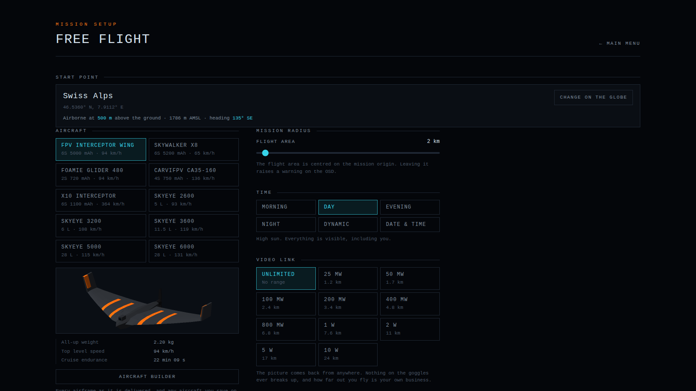

Difficulty drives the AI, not the aeroplane:

| | Easy | Normal | Hard |
| --- | --- | --- | --- |
| | Slow to notice you, aims where you are rather than where you will be | Sees you at reasonable range and leads the shot | Picks you up early, predicts well and commits hard |
| Sight range | 55% | 85% | 100% |
| Field of view | 100° | 130° | 170° |
| Reaction time | 1.6 s | 0.8 s | 0.3 s |
| Hardest bank | 40° | 55° | 70° |
| Evasion chance | 60% | 35% | 15% |

Everything generated from the mission — spawn points, patrol routes, transit
routes, race courses, display routines, wind and the cloud field — comes from
the seed. Fly the same seed twice and the same contact is waiting in the same
place.

### Debrief and logbook

A flight that reaches a debrief is written into the pilot's logbook: a flat
list of finished flights, newest first, capped at 200. Career totals and
personal bests are derived from that list every time they are shown.

---

## The hangar

Ten aircraft, each flyable exactly as delivered:

| Aircraft | What it is |
| --- | --- |
| **Interceptor wing** | 1.4 m foam delta, 2.2 kg, 95 km/h |
| **Skywalker X8** | 2.1 m survey wing, 2.7 kg, 70 km/h, an hour of it |
| **Foamie Glider 480** | 480 mm foam glider, 141 g, 94 km/h, ten minutes of it |
| **CarviFPV CA35-160** | 160 mm quadcopter, 293 g, 130 km/h, six minutes of it |
| **X10 Interceptor** | 560 mm rocket quad, 450 g, 364 km/h, ten minutes of it |
| **Airmobi Skyeye 2600** | 2.6 m petrol UAV, 15 kg, 93 km/h, two and a half hours |
| **Airmobi Skyeye 3200** | 3.2 m petrol UAV, 25 kg, 108 km/h, three hours |
| **Airmobi Skyeye 3600** | 3.6 m petrol UAV, 30 kg, 119 km/h, four and a half hours |
| **Airmobi Skyeye 5000** | 5 m petrol UAV, 90 kg, 115 km/h, eight hours |
| **Airmobi Skyeye 6000** | 6 m petrol UAV, 115 kg, 131 km/h, nine hours |

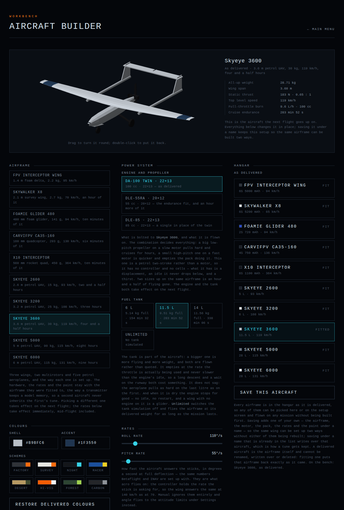

**The wings.** The interceptor is the 1.4 m delta. The X8 is the survey wing at
its real 80 dm² and 2.5–3 kg — slower, steadier, and able to stay up for an
hour on the right pack. The Foamie Glider 480 is the moulded EPP chuck glider
with two Happymodel EX1202.5 KV6000 motors in the wing, 2.5-inch propellers and
a 2S 720 mAh pack: 141 g all up, 27 km/h stalled, 94 km/h flat out. It has a
fin and tailplane, which neither of the other wings does, so it weathervanes,
holds a heading hands-off and flies out of a stall by itself. With the motors
shut down it glides, which no other aircraft here does. At 141 g, a gust the
survey wing rides through will put it on its back.

**The multirotors.** Both make no lift, have no stall and no glide, hover, and
are steered by differential rotor thrust rather than by air — so they answer
the same hovering as flat out, and not at all on a flat pack. The CA35-160 is
293 g on four T-Motor P1604 3800 kV turning HQ 3.5×2.5 tri-blades. It is a flat
plate: leaning over to go fast puts the air on its belly, and that is where its
top speed comes from. The X10 Interceptor is a 560 mm body standing on four
fins with four swept pylons carrying 2450 kV motors, 450 g on a 1100 mAh 6S
pack. It lies along the rotor axis, so leaning over points it into the airflow
instead of turning it broadside, and its drag area falls by a factor of eight
as it accelerates — nearly three times a racing quad's top speed on four-inch
propellers. It is sluggish slowly, has a rocket's inertia, spins about its own
axis about as readily as it rolls, empties its pack in well under a minute at
full throttle, and — with fins — puts its nose down and arrives like a dart
when the thrust is gone.

**The aeroplanes.** The five Airmobi Skyeye are one airframe at five sizes,
each named for its span in millimetres: a carbon fuselage pod with the payload
in the nose, a high tapered wing, twin tailbooms, a pusher between them and a
fixed tricycle undercarriage. Two things separate them from everything else:

- **Petrol.** The throttle closed is an engine idling, not a motor stopped —
  about a sixteenth of full thrust. A Skyeye will not slow down on the approach
  the way a wing does, and it has to be starved deliberately. The idle gives up
  by flying speed: an idling propeller has nothing left above a quarter of its
  pitch speed.
- **Wheels.** They roll at a tenth of a foam belly's friction, so an aeroplane
  can accelerate to flying speed under its own power. They hold the airframe
  nose-up at a twelfth of the span so the elevator can rotate it off, and they
  will take an arrival at 160 km/h that a belly comes apart at — while being
  far less forgiving of landing banked or crabbed.

They carry hours rather than minutes: the 3600 has 11.5 litres built into the
fuselage and stays up four and a half hours on it.

### Flying and landing

Assisted modes mean what they mean on the airframe they are on. On a multirotor
**angle** leans the aircraft to the stick, a held **course** is held on the yaw
axis, **altitude hold** holds height on the throttle and leaves the pitch stick
to the pilot, and **return home** comes back, stops over the field and descends
onto it.

A wing has no undercarriage, so landing it is a belly slide: fly a shallow
approach onto open ground — wings level with the slope, nose up, sinking no more
than about 3 m/s — and it touches, slides and stops in one piece. The OSD reads
`ON THE GROUND` while it slides and `LANDED` once it stops. Anything steeper,
faster, banked or sideways is a crash. What separates them is measured at the
instant of contact: sink rate along the surface normal, bank, nose attitude
relative to the slope, sideslip and ground speed.

From a standstill, full throttle and back stick fly a wing off again at a
little over 40 km/h. A Skyeye rolls off its wheels the same way.

---

## The aircraft builder

The builder owns the aircraft: the airframe, what is fitted to it, the rates it
is flown on and the colours it wears. Everything that is not the aircraft lives
in Settings.

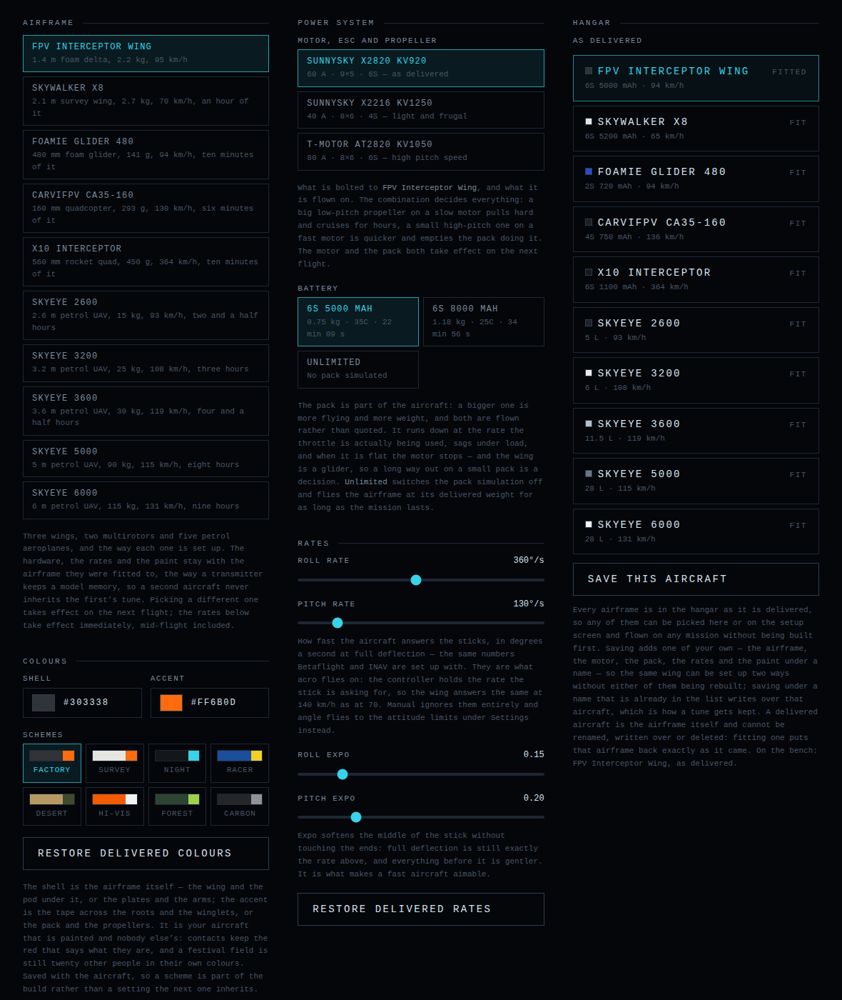

### Power system

Each aircraft takes a **motor, ESC and propeller** combination and a **battery**
— or, on a Skyeye, an **engine** and a **tank**. The catalogue is the hardware
these airframes are actually flown on, and each entry is the thrust and pitch
speed the flight model integrates, not a label.

**Electric airframes:**

- The interceptor takes SunnySky-class 2820s and 2216s, 40–80 A, 4S and 6S.
- The X8 takes a SunnySky X4250 KV500 on a 12×6 for 6S, a 4255 KV520 on a 14×8
  for heavy packs, and a 12×8 sport fit; 5 to 16 Ah of LiPo.
- The glider takes four combinations: the delivered EX1202.5 KV6000 on 2.5×2.5,
  the same motor on a lower KV for endurance, a higher-pitch propeller, and a
  3S conversion that takes it past 105 km/h. Packs run 450 mAh to a pair of
  18650s that keep it up the better part of an hour.
- The CA35-160 takes four: the stock 3.5×2.5 tri-blades on 4S, a higher-pitch
  propeller for another 15 km/h, and the 6S racing conversion. Packs run from a
  450 mAh sprint pack good for three minutes, through the delivered 750 and a
  1100, to a 3 Ah lithium-ion that makes it a twenty-minute aircraft.
- The X10 takes four-inch propellers cut at a pitch two thirds again their own
  diameter, a higher-pitched one, a lower-KV motor for loiter, and an 8S
  conversion. Its lithium-ion pack doubles the loiter and leaves nothing for
  the dash.

**Skyeye engines** carry a displacement, the rpm they peak at with a given
propeller, the rpm they idle at and their specific fuel consumption — no KV, no
controller, no cells. Each airframe takes the engines it is sold for: 20–35 cc
on the 2600, 50–80 on the 3200, 50–100 on the 3600, 150–180 on the 5000, and
the injected 180 on the 6000. Fuel burn per kilowatt-hour of shaft work is the
number that decides endurance: the 20 cc drinks nearly three litres per
kilowatt-hour where the fuel-injected 180 manages one.

**How the choice is flown:**

- **The pack runs down at the rate you are flying.** Current comes from the
  thrust the propeller is really making at the airspeed the air is arriving at.
  The OSD shows charge, volts, amps and flight remaining.
- **Voltage sags.** Rpm follows terminal voltage and thrust follows its square,
  so an aircraft is punchier off the charger than twenty minutes later.
  Lithium-ion cells have several times a LiPo's internal resistance, and that is
  simulated rather than quoted.
- **When it is flat, the motor stops.** The ESC cuts before the pack is ruined.
- **A bigger pack is a heavier aircraft.** 16 Ah is another kilo of X8: more
  endurance, more wing loading, a little less top speed.

**A tank** is the same four things in a different liquid. It empties at the rate
the throttle is used and never below the engine's idle burn, so a descent and a
wait on the runway both cost something. It does not sag — the aeroplane pulls
as hard on the last litre as the first. When it is dry the engine stops for
good. And 11.5 litres is 8.5 kg that has to be carried whether it is burnt or
not. The OSD reads the same gauge either way: where a pack shows volts, amps
and milliamp-hours, a tank shows litres, litres an hour and litres burned.

Pick **Unlimited** instead of a pack or a tank and none of it is simulated. The
airframe still weighs what it weighs, and the flight lasts as long as the
mission.

### Rates

Betaflight- and INAV-style rates: the rotation the aircraft is asked for at
full stick, in degrees a second, with an expo that softens the middle of the
travel without moving the ends. Roll and pitch each have a rate and an expo.

They are stored **per airframe**, the way a transmitter keeps a model memory,
and can be changed mid-flight. They are what **acro** flies on: the controller
measures the rotation the aircraft is doing and winds on however much control
it takes to make that the rotation the stick asked for, so the aircraft answers
the same at 140 km/h as at 70. Ask for more than the airframe has at the speed
it is doing and it gives everything it has.

Delivered rates run from the X8's 180°/s roll to the CA35-160's 720°/s.

### Livery

Every aircraft carries a shell colour and an accent, stored with the airframe
like its rates. Each part of the mesh says which of the two it wears and how
much of it, so painting the shell moves the top, the underside and the pod
together. Only your aircraft is painted: contacts keep the red that says what
they are, and the tint that marks them goes over whatever they are painted.

The picture beside the aircraft is the same mesh the flight uses, projected and
flat-shaded onto a plain 2D canvas. Drag it to turn the aircraft round.

### As delivered, and saved builds

**As delivered** lists all ten aircraft under their own names, each with the
combo, pack, rates and colours it ships with. These are worked out from the
airframe rather than stored, so they are always all there and cannot be
renamed, written over or deleted. Fitting one is how an airframe is put back
exactly as it came.

The workbench holds **one setup per airframe** — the aircraft as it stands right
now. A setup worth keeping is saved under a name of its own, under **saved** in
the same list: airframe, combo, pack, rates and paint, exactly as they are on
the bench. Saving under a name already in the list writes over it. An
airframe's own name cannot be taken, because the delivered aircraft already
answers to it. Saved builds can be renamed, deleted, or fitted back onto the
bench.

Both lists are offered on the mission setup screen with a picture, all-up
weight, top speed and cruise endurance. Choosing there fits the aircraft;
moving a slider on the bench afterwards deselects it, because the selection is
whichever aircraft the bench currently matches.

---

## Flight modes

The player's own aircraft carries a flight controller with the same layers an
INAV wing has:

- **Manual** — whatever you ask for goes to the control surfaces. Nothing
  levels the aircraft.
- **Acro** (`F`, the default) — the gyro holds the rates above, so the sticks
  command a rotation rate. Letting go stops the rotation and leaves the
  aircraft where it was put.
- **Angle** (`F`) — the sticks command an attitude. Full roll is the bank limit
  rather than a roll rate, and letting go levels the wing.
- **Course hold** (`C`) — locks the current heading and flies it. The roll
  stick walks the locked course instead of banking.
- **Altitude hold** (`H`) — locks the current height and flies it. The pitch
  stick walks the locked height. You keep the throttle; the controller leans on
  it for a commanded climb and to keep the aircraft off the stall.
- **Cruise** — the two holds together: a heading and a height, hands off.
  Either can be flown over any of the three base modes.
- **Return home** (`R`) — flies back to the launch point on its own, using the
  same terrain look-ahead the AI uses so it goes over a ridge rather than into
  it.

No mode can do anything a pilot could not: every one of them ends in a stick
position through the identical aerodynamics, so an assisted aircraft can still
be over-banked, stalled and flown into a hill. The one thing they refuse is to
hold the aircraft in a stall — below the guard speed they put the nose down and
get the speed back.

Settings → **Flight modes** configures the controller, on the same screen the
pause menu embeds, so it can be changed mid-flight:

| Setting | What it does |
| --- | --- |
| Roll / pitch rate | The rotation full stick asks for in acro, degrees a second (on the builder, per aircraft) |
| Roll / pitch expo | How much of the stick's travel is spent being gentle around centre |
| Mode at launch | Which mode a flight starts in |
| Bank limit | Hardest bank angle mode and course hold will command |
| Pitch limit | Steepest attitude angle mode will command |
| Course / altitude trim rate | How fast full stick walks a held course or height |
| Return altitude | `At least` climbs to it but never descends to it, `Fixed` always flies it, `Current` keeps the height the return started at, `Extra` adds to it |
| Return height | The figure those four are measured in, above the ground at home |
| Climb before turning back | On, it climbs first and then points at home; off, it turns straight away and climbs on the way |
| On arrival | Circle overhead, or spiral down and land |
| Loiter radius | The circle held over home |
| Return speed | The airspeed it comes home at |
| Sticks take it back | Whether moving pitch, roll or yaw cancels the return |

A return set to land flies a descending circle over the field and commits at
about forty metres: from there it holds one course, wings level, and sinks onto
the ground at a couple of metres a second, flown at the return speed.

While anything other than acro alone is engaged, the OSD says so in the top
right: the mode, the course and height being held, and — during a return — how
far home is and which way.

---

## The weather system

Weather is one piece of data: the cloud decks, the visibility, what is falling,
whether it is thundering, and the wind at each height. It is set on the mission
setup screen and can be changed again from the pause menu mid-flight.

### Time of day, date and sun

Six choices. **Morning**, **Day**, **Evening** and **Night** put the clock at a
local solar hour on the day the flight is flown. **Dynamic** does the same and
runs the clock at 240×, so a whole day passes in about six minutes.

The sixth is **Date & time**: a calendar date and a clock time, read as
**local** time at the launch site or as **UTC**. Both suns — Cesium's, for the
light, and the simulation's, for how far anything can be seen — are put where
the real one was over that place at that moment. The panel shows the sun's
elevation as the setting is edited, and the same instant written out in the
other zone.

Local time is the whole-hour zone the site's longitude falls in, one hour per
fifteen degrees. There is no daylight saving in it and no allowance for
countries on a half-hour offset or a redrawn boundary; the worst case is half
an hour of sun, and UTC states the instant exactly.

Daylight is computed in the simulation rather than read back off the renderer,
so detection ranges do not depend on what Cesium is drawing.

### Four ways to set the weather

The same panel appears on the setup screen and in the pause menu.

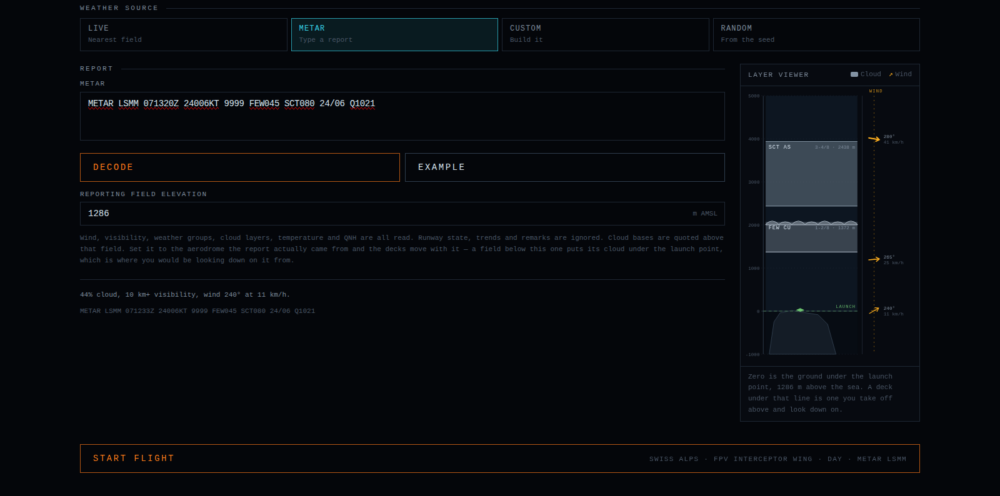

- **Live** — the current report from the nearest aerodrome, fetched from NOAA's
  Aviation Weather Center. It finds the nearest reporting station, so one
  report is downloaded rather than a hundred. It is fetched as soon as the
  panel opens. Cloud bases are reported above the *station*, so the difference
  between the station's elevation and the ground under the mission is
  subtracted.
- **METAR** — paste a report and fly it. Wind, gusts and the variable range,
  visibility in metres or statute miles, weather groups, cloud layers including
  `CB` and `TCU`, vertical visibility, temperature, dew point and QNH in hPa or
  inches are all read; runway state, trend groups and remarks are skipped. A
  typed report carries a four-letter code rather than an elevation, so the panel
  asks for the **reporting field's elevation** and shifts the bases by the step
  between that field and the ground under the mission. It starts at the
  mission's own ground.
- **Custom** — build it. Up to three decks, each with a reported amount
  (`FEW`/`SCT`/`BKN`/`OVC`), a genus (cumulus, stratocumulus, stratus, towering
  cumulus, cumulonimbus, nimbostratus, altostratus, cirrus), a base and a
  depth; visibility; rain or snow and how hard; a thunderstorm switch; and as
  many wind levels as you like. Decks are independent — a base can be dragged
  straight past its neighbour, and they are sorted where the sky is resolved.
- **Random** — a day drawn from the mission seed. It picks a *situation* first
  — a ridge of high pressure, a warm sector, a front going through, an unstable
  afternoon, storms, a cold snap, a radiation-fog morning — and fills in the
  detail inside it.

The panel opens on **Live**, and after that on whichever of the four that pilot
last used. Any of them can be switched to **Custom** and edited; switching a
fetched or generated day to **METAR** brings its report across as text.
Whatever you end up with is written back out as a METAR under the panel.

There is no preset list. Every sky is still filed under the preset it most
resembles, so the logbook and debrief can name the kind of day in one word.

### Visibility

**The visibility is a distance, not a look.** What the panel reports is what
the fog is solved backwards from: the air is given the extinction that
definition implies — a ridge down to a twentieth of its contrast at exactly
that range — and the renderer inverts its own fog curve against it. Ask for
five hundred metres and the far side of the valley is gone at five hundred
metres.

Three things had to be taken off Cesium for that to be true:

- **Height.** Cesium thins its fog by how far the camera is above the *sea*,
  which over the Alps thinned it several-fold for a reason no pilot would
  recognise. Visibility here is a property of the airmass — the same one the AI
  and the video link are flown against — and it does not improve because the
  mountain is tall.
- **Where the camera is pointing.** Cesium fades its fog out as the camera
  turns away from level, so an FPV lens on its usual up-tilt flew in a third
  less weather than the sky it was in. That term is cancelled every frame
  through the one knob the fog shader reads and the tile culling does not, so
  the number the terrain detail is decided from only ever moves when the
  weather does. A pitching aircraft never re-decides how detailed the valley
  is, and neither does one crossing a deck: the inside of a cloud is carried
  by the same knob, because terrain culled for the four seconds you were in
  the cloud is terrain fetched again on the way out.
- **The colour.** The fog is lit by the sun's height, and with the floor it had
  a hazy morning turned distant terrain dark instead of white. The floor now
  follows the daylight, and the whiteout grades in with the visibility rather
  than switching on under a threshold.

**Thick air is cheaper, not dearer.** Terrain that would be drawn in full fog
is culled and what is left of it is coarsened, and the cloud march stops where
the air does rather than drawing crisp cumulus five kilometres into a whiteout.

Settings → **View distance** is a ceiling on the same number: the air is
thickened until the horizon sits there, so it pulls a clear day in and leaves a
foggy one alone. It is a fog setting and not a frustum one — shortening the far
plane would clip the atmosphere shell and turn the daytime sky black.

### Cloud

**Cover** is not set directly: a sky says how much cloud is in it by having the
decks it has, each with its own reported amount. The resolved figure drives the
volume, the billboard field, the fog inside a deck and how much of a contact
the cloud hides. At nothing, no deck is built and there is no cloud to lose a
contact in — the cheapest sky in the simulator.

Cloud is drawn as a **volume**. Every pixel of the frame is a short ray march
through the band the decks live in, run as two post-process stages: the march
itself at a fraction of the framebuffer, and a full-resolution pass that
composites it over the scene so terrain, aircraft and HUD stay crisp. The shape
is hashed value noise evaluated in the shader — no textures, nothing on the CPU
— and coverage moves the threshold the noise has to clear, so the same field
goes from a few cumulus to solid overcast without being rebuilt. Fly into a
cumulus and it closes over the canopy.

Up to three decks are marched in one pass: the ray covers their union and every
step evaluates each deck. Each has its own coverage, opacity and shape — a
cumulonimbus towers with its mass while a stratus sheet fills its slab flat —
and drifts at the wind of its own altitude. The march is clipped against the
depth buffer, so a ridge occludes cloud behind it, and against a maximum
distance it fades into. It skips ahead through empty air, stops as soon as the
ray is opaque, gives up on rays that never cross a deck, and takes longer steps
further out. The graphics preset sets the step counts, and the GPU sets how much
of the framebuffer they are marched over — see **Graphics quality** below.

With **Volumetric clouds** switched off, or on a machine whose shader compiler
will not take the march, the fallback is Cesium's `CloudCollection`: clusters of
GPU billboards centred on the aircraft that drift downwind and wrap round, so
the cloud count is fixed however far a mission ranges.

Cloud bases are **signed**: zero is the ground under the launch point. Fly from
a ridge and a deck reported by the aerodrome down in the valley is drawn below
you. The one place the sign cannot survive is the report written back out, since
`BKN` has three digits and no minus.

### Wind aloft

Wind is a stack of levels, each quoting a direction and a speed, exactly as a
wind aloft forecast does. Between them the speed is interpolated and the
direction walked the short way round, so a surface southwesterly backing to a
westerly at 2000 m is a continuous shear through the climb. Below the lowest
level and above the highest a logarithmic boundary-layer profile takes over.

Gusts and direction variation are separate controls. Every level gusts together
— one airmass — while each keeps its own mean. A METAR measures the wind at ten
metres, so a gradient wind is put above it, stronger and veered right.

A preset's whole profile is veered to a seeded bearing, keeping its shear. A
wind that was observed, typed or generated is left exactly where it was.

### Rain, snow and lightning

**Nothing falls above the highest cloud top.** Climb through the weather and it
fades out over a couple of hundred metres and stops. An empty sky is the only
sky with no lid; a lid *below* the launch point is not one, so dropping off a
ridge into the deck in the valley is still wet.

Rain is a single full-screen post-process pass drawn from hashed noise, so
heavy rain costs the same as light rain. The drops move relative to the camera,
which at flight speed is almost entirely the aircraft's own motion: the camera
is differenced frame to frame, and the velocity of a drop as seen from it gives
one vanishing point. Streaks fan out of that point, shortest beside it and
longest at the frame edge, and lengthen with speed. It works in chase and orbit
views too.

Snow is the same pass with the physics changed: a flake falls at about a metre
a second instead of seven, so the field hangs nearly still when the aircraft is
slow and streaks horizontally when it is fast. Flakes are short round dabs
rather than hairlines, and the scene is not darkened the way rain darkens it.

**Lightning** is scheduled inside the deepest deck when the sky has a
cumulonimbus in it or the report said `TS`. The flash lights the scene from
above, and the thunder reaches the soundscape with the delay the distance
implies, so counting the seconds works. The schedule is seeded.

### The layer viewer

The panel draws the sky down its right-hand side: an altitude axis with the
ground on it, the cloud decks as bands, and the wind levels in a lane of their
own. It follows whatever is being described — a fetched report, a decoded one,
a generated day, or a deck whose base slider is being dragged right now.

A deck is a pale filled band, scalloped on top when its genus piles up, ruled
when it does not, broken when it is cirrus. A wind level is an amber arrow on a
hairline lane, pointing the way the air is *going*. The controls that build
them carry the same two accents: cyan for decks, amber for levels.

### Changing it in the air

**Time & weather** in the pause menu re-grades the scene, moves the clock, lays
the decks out again from the same seed and re-quotes the wind without the
aircraft leaving the sky. The wind keeps the oscillator phases the seed gave it
and takes on only the new strength. The change is written back to the mission,
so restarting keeps the sky you were flying in.

### Weather rendering settings

Settings → **Graphics** carries **Clouds**, **Volumetric clouds**, **Rain** and
**Weather effects** as separate switches, so any of them can be dropped on a
machine that is struggling. An empty Custom sky is the cheapest option of all.

---

## The video link

Everything the pilot has is one analogue video channel coming back from the
aircraft, and it runs out before the airframe does.

The transmitter is a setting, in the powers real 5.8 GHz hardware is sold in:
**25, 50, 100, 200, 400, 800 mW, 1, 2, 5 and 10 W, or unlimited** (the
default). Received power falls with the square of distance, so usable range
goes with the square root of transmitted power: four times the transmitter is
twice the reach. 25 mW carries about 1.2 km in the open, and the rest of the
ladder follows.

Three things decide what is on the goggles:

- **Range.** Clean out to about 60% of it, then a smooth fade to nothing. The
  link degrades rather than switching off, and the break-up is the warning.
- **Terrain.** 5.8 GHz does not go through a ridge. The link is carried on the
  same sampled line of sight the visibility model uses, so dropping into a
  valley costs the picture and climbing gets it back.
- **Where the pilot is standing.** The ground station is at the mission origin,
  so range is measured from the point the flight started from.

Fly with no picture at all for fifteen seconds and the airframe is written off.

The static is generated as numbers: a signal quality and a clock become the
opacity of the snow, the height and position of the rolling sync band and how
hard it is tearing, out of two oscillators whose periods do not divide into
each other. The canvas layer paints it into a small offscreen buffer blown up
with smoothing off.

The static sits **above** the OSD: losing the link loses the instruments too.

---

## The HUD

The numeric OSD is DOM text updated ten times a second. The artificial horizon,
target indicator and minimap share one full-viewport canvas driven by a single
animation frame at display rate.

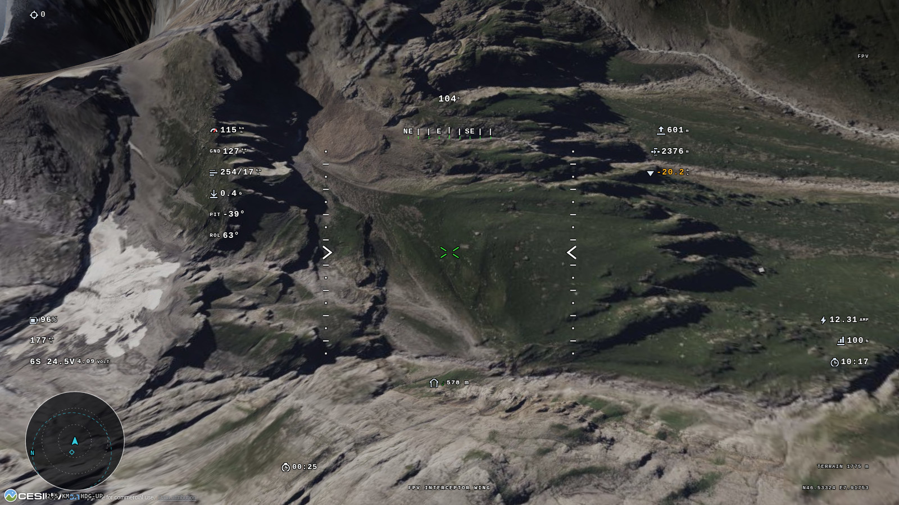

The **target indicator** works in camera axes rather than projecting the
target, so the arrow stays correct all the way around the clock. Which contact
is boxed is chosen with `T` (or a bound transmitter button), and the indicator
carries a `2/5` alongside the range whenever there is more than one to choose
between. The minimap marks the selection too.

The **minimap** is a plain 2D canvas drawing the same local ENU metres the
flight model runs in, scaled down and centred on the player. Orientation is
north-up or heading-up, and range is 1, 2.5, 5, 10 or 25 km.

### Arranging the OSD

Every element — each readout, the warnings, the compass ribbon, the crosshair,
the horizon and the minimap — is switched on and placed under **Settings → OSD
layout**. Drag an element around the picture, or nudge the selected one a cell
at a time with the arrow keys; the list beside it switches any of them off.

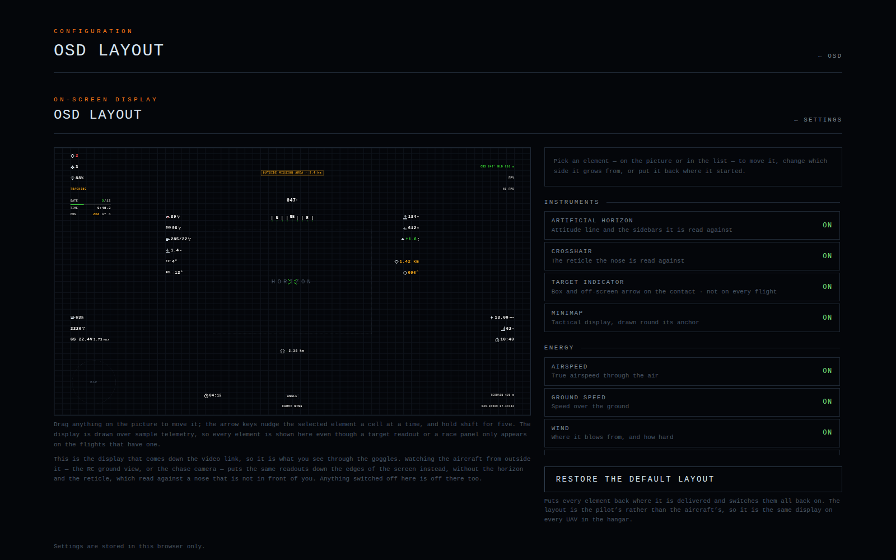

Placements are cells on a 60 × 48 grid rather than pixels, so a layout arranged
on a laptop still reads on a 1440p monitor and nothing ends up half off the
edge. Three elements — the horizon, the crosshair and the target indicator —
are read against the middle of the picture or against the contact itself, so
they can be switched off but not moved. Type is sized off the height of the
display rather than in screen pixels.

The editor previews the real telemetry panel over sample telemetry, laid out at
1920×1080 and scaled into whatever room the screen has. The layout belongs to
the pilot, not to an aircraft: it is the same display on every aircraft in the
hangar.

---

## Sound and music

Nothing is sampled. The motor is an oscillator pair at the propeller's
blade-passing frequency with a band of blade wash riding on it; the airframe
rush is filtered noise; every one-shot is an envelope over one of those two.
Pitch is continuous, following the motor's own rev range.

Airspeed matters as much as throttle: a propeller flying faster than its pitch
is driven by the air, so a closed throttle in a dive still turns the motor and
still makes a noise. The rush follows the square of airspeed.

Damage is heard before it is read. A machine that has been into another one
turns slower for the same stick, loses some of its tone, gains a wash of
broken-blade noise, and beats once per turn of a shaft that is no longer true —
a flutter at idle, a rasp at full throttle. All of it grows with the damage, so
the third contact sounds worse than the first, and a hit from behind, which is
where a pusher keeps its motor and its propeller, is the one that changes the
noise most. When the airframe finally stops flying the motor stops with it and
only the rush is left.

Music is streamed live from [SomaFM](https://somafm.com) — listener-supported,
commercial-free internet radio. A channel is a plain MP3 stream; there is no
account, API key or credential, and nothing is downloaded, cached or shipped.

What plays follows what the pilot is doing rather than the screen they are on,
so the menus, the globe, the setup screen and the flight are one continuous
piece of music and the station changes when the mission does: downtempo in the
menus, deep house on a free flight, electropop at a display or a fly-in,
something with a pulse on a gate course, and the spy-film channel for an
interception or a strike. Any of the eight channels can be pinned instead, with
the mood's own channels kept behind the pin as fallbacks.

If a mirror will not serve, the list is walked; if a station produces no sound
inside twelve seconds it is given up on; a dropped stream is reconnected once.
When nothing can be reached the simulator is silent. Browsers refuse to start
audio before the page has been interacted with, so an unclicked page offers a
small prompt in the corner, and any click or key takes it.

Music sits under the aircraft: full on its own slider is two thirds of full
scale. Settings → **Audio** has the master **Sound** switch, which outranks it.

---

## Pilots, logbook and backups

Everything a pilot accumulates — settings, key layout, controller profiles and
every flight that reached a debrief — is stored against that pilot rather than
against the browser. Switching between pilots is one click on the **Pilot**
screen.

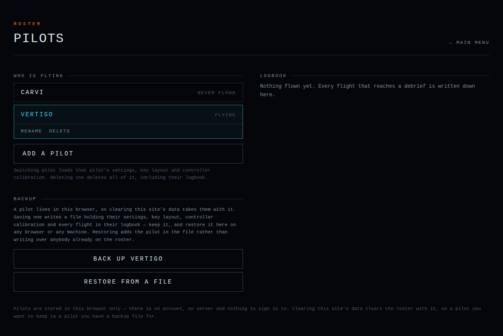

There is no server and no database. **Back up** writes the flying pilot out as
one JSON document — callsign, logbook, and the stored block of every
pilot-scoped store — and **Restore from a file** reads one back, on this
browser after a clear-out, on another browser, or on another machine. A restore
never writes over anybody: the pilot in the file joins the roster, numbered
(`Vertigo 2`) if that callsign is already flying here. Nothing is uploaded
anywhere.

A restore is also offered on the first-run screen, before there is a roster.

The Cesium ion token sits outside the per-pilot namespace: it is one key for
the installation, survives a pilot being deleted, and is not written into a
backup, so a backup file can be handed to somebody else without handing them
your ion account.

---

## Settings reference

Settings is sorted into five categories:

| Category | What is in it |
| --- | --- |
| **Graphics** | Quality preset (Auto, Low, Medium, High, Ultra), world detail, view distance (default 60 km), FPV field of view (default 100°), camera shake, chase camera distance and height, clouds, volumetric clouds, rain, weather effects |
| **Flight modes** | The flight controller table above, plus stick sensitivity for keyboard and controller |
| **OSD** | On-screen display switch, the layout editor, minimap orientation and range |
| **Audio** | Sound switch and volume, music switch, volume and station |
| **Cesium ion** | The saved token: shown, replaced or forgotten |

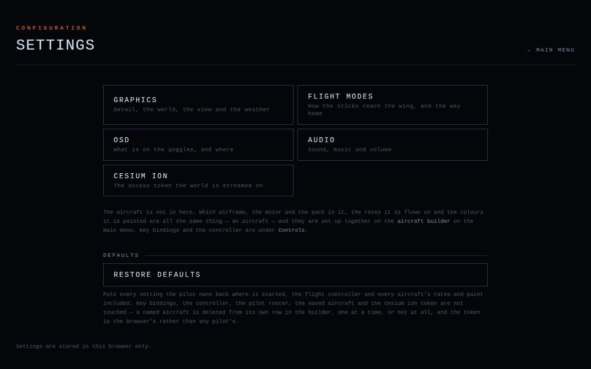

### Graphics quality

**Auto is the delivered setting, and it asks the machine.** A 1×1 WebGL context
is created once, read and dropped: the unmasked renderer string, whether the
context is WebGL 2, its maximum sample count and texture size, and what the
browser will say about system memory and core count. That is turned into a class
of GPU — software rasteriser, mobile part, integrated chip, discrete card, or a
discrete card with room to spare — and the preset that class is good for.
Whatever it concludes is named on the Graphics pane, so a machine given Medium
says why, and any of the four presets can be picked instead.

| What was found | Preset |
| --- | --- |
| SwiftShader, llvmpipe, Microsoft's basic renderer | Low |
| Adreno, Mali, PowerVR, an Apple A-series part | Low |
| Intel HD/UHD/Iris, an AMD APU | Medium |
| A GeForce, Radeon, Arc or Apple M-series part | High |
| The upper half of a current generation, or an M-series Pro/Max/Ultra | Ultra |
| A renderer the browser masks | Medium, or High on a machine that reads as a desktop |

Two things override that upwards choice: a context that cannot do WebGL 2 drops
to Low whatever card is behind it, and Ultra's gigabyte and a half of tile cache
is not asked of a machine that reports less than 8 GB of memory to hold it in.

**Some of the frame is provisioned from the GPU whichever preset is chosen.**
The preset says how much *world* is drawn — terrain detail, tile caches,
screen-space error — and that is the pilot's choice. How the frame is put
together is not on the menu, and follows the hardware:

- **Multisampling.** Presets ask for two samples plus Cesium's full-screen FXAA
  pass. A discrete card is asked for four hardware samples and the FXAA pass is
  dropped: four samples do its job, and a whole screen of fragment work is
  handed back. This is the one place where asking the GPU for *more* makes the
  frame cheaper. Integrated graphics keep the preset's two and the cheap pass; a
  software rasteriser is asked for neither; and nothing is ever asked for more
  samples than the context says it has.
- **The cloud march.** Every preset marches at half the framebuffer or less and
  upscales. A card with headroom marches at the full framebuffer instead, which
  is where the soft cloud edges come from; a phone or a software rasteriser
  marches at a third. A preset that had already given up half the framebuffer —
  Low — is only ever lowered further, never raised.

All of it is decided **once, before the flight**, from hardware that will not
change during one. Nothing here re-reads a frame counter.

**The preset is what is drawn.** Nothing lowers it behind you mid-flight. The
simulator did try that — a detail radius bounded to the mission, plus a governor
that gave up screen-space error, then multisampling, then render scale as the
frame rate fell — and it was worse on both counts: the picture got softer and
the stutters stayed, because the stutters were never the far side of the valley
being sharp. They were the world arriving through one main thread in the seconds
somebody was flying.

**So loading is deliberately front-loaded instead.** Nothing is flown until the
world is there:

- The terrain elevation the flight model reads is sampled over the whole mission
  area, up to four kilometres out, so a flight that stays in its own airspace
  asks the elevation service for nothing once it is airborne.
- The loading camera is swung right round the field, eight points of the
  compass, so the tiles the first turn uncovers are already in the caches.
- Then it climbs and looks out, once, so the ground between the field and the
  horizon — what a climb or a long look ahead would otherwise fetch in flight —
  is staged too.
- Terrain siblings and the whole width of the view are loaded rather than
  deferred: Cesium defers tiles at the edge of the screen by default, which in
  an aircraft is exactly where the next second of flight comes from.
- Every aircraft in the mission is drawn once under the loading screen, so its
  geometry and shaders reach the GPU before the first frame the pilot sees.
- The tile caches are sized to hold all of that, because a preload that is
  evicted before the pilot turns into it was a wait for nothing.

That costs seconds of loading and buys an opening minute that is not made of
stutters, which is the trade a simulator should make. A frame rate that will not
hold is answered with a lower preset before the next flight, by the person
flying it.

---

## The desktop application

`src-tauri/` is a [Tauri](https://tauri.app) v2 shell — a native webview and a
few lines of Rust — around a static export of the same build the web version
runs. On Windows that webview is WebView2.

```bash
npm run desktop:dev            # the window, on a dev server, with hot reload
npm run desktop:build          # the installer, under src-tauri/target/release
```

Both need a [Rust toolchain](https://rustup.rs). On Linux the webview is
WebKitGTK and its development packages have to be installed —
[Tauri's prerequisites](https://tauri.app/start/prerequisites/) list them per
distribution. Only Windows is built for release.

There is no server behind the page, which matters for the web build's two route
handlers. `/api/radio` proxies the music stream, because SomaFM refuses any
request whose `Referer` names localhost; the packaged build sends no `Referer`
at all instead, through a `no-referrer` policy on the document. `/api/metar`
fetches the live weather, and aviationweather.gov sends no allow-origin header,
so the shell makes that one request from native code through Tauri's HTTP
plugin, scoped in `src-tauri/capabilities/default.json` to that host. The lookup
itself is the same code either way. Both routes are named `route.web.ts` and
kept out of the export by `pageExtensions` in `next.config.ts`.

### Releasing

Actions → **Release** → **Run workflow**. It works out the version, runs the
typecheck and the simulation tests, builds the application and publishes it
under Releases with the installer and the portable executable attached.

Versions are dated: `2026.09.1` is the first release of September 2026,
`2026.09.2` the second, and October starts again at `2026.10.1`. The count
comes from the tags already in the repository.
`scripts/release-version.mjs` works it out and stamps it into the build; the
version in `src-tauri/tauri.conf.json` stays `0.0.0` in the repository. The
workflow takes a version to force one, and can publish a draft first.

The script emits two spellings of the same number: `2026.09.1` is the tag, the
release and the downloaded file, and `2026.9.1` is what Cargo and Tauri are
given, since both parse it as semver. The installer is NSIS rather than MSI,
because Windows Installer will not take a major version above 255.

---

## Development

### Scripts

| Command | What it does |
| --- | --- |
| `npm run dev` | Development server |
| `npm run build` | Production build |
| `npm run start` | Serve the production build |
| `npm run typecheck` | `tsc --noEmit` |
| `npm run test:sim` | Simulation test suite |
| `npm run bench:sim` | What the simulation costs per frame, at a given contact count |
| `npm run desktop:dev` | The desktop window, on a live dev server |
| `npm run desktop:build` | The desktop application, installer and all |

`predev` and `prebuild` run `scripts/copy-cesium.mjs`, which stages CesiumJS
into `public/cesium`. That directory is generated and git-ignored. CesiumJS is
loaded at runtime from its own prebuilt browser bundle rather than being
re-bundled; types come from the `cesium` package through type-only imports.

### Layout

| Path | What is in it |
| --- | --- |
| `src/app` | Next.js app routes |
| `src/components` | React UI: `flight`, `hud`, `screens`, `ui` |
| `src/lib` | Cesium setup and environment helpers, audio, desktop runtime |
| `src/sim` | The simulation core — physics, flight, AI, mission, terrain, input, math, render, environment, hud, player — framework-agnostic |
| `src/state` | App and store state |
| `src-tauri` | The Tauri desktop shell |

The coordinate chain is `Earth → Cesium Cartesian (ECEF) → local ENU →
physics`: the flight model runs in a local east-north-up frame in metres,
re-anchored as the aircraft ranges.

### Testing

`npm run test:sim` runs 3839 checks with no test-framework dependency. It
covers the maths and geodesy (attitude quaternion round-trips, WGS84
conversions against reference values, ENU round-trips including tangent-plane
curvature at 50 km, coordinate parsing), the flight models (fixed wing,
multirotor, glider, rocket and the petrol aeroplanes), power systems, launch,
landing, damage and explosions, terrain sampling, the AI, every mission mode,
the weather model and METAR decoder, the video link, the HUD and OSD layout,
controllers and key bindings, audio and music, liveries, builds and pilots.

Run `npm run typecheck` and `npm run test:sim` before considering a change to
`src/sim/**` complete.

### Stack

Next.js 16 (App Router) · React 19 · TypeScript (strict) · Tailwind CSS 4 ·
CesiumJS · Zustand · Rapier
